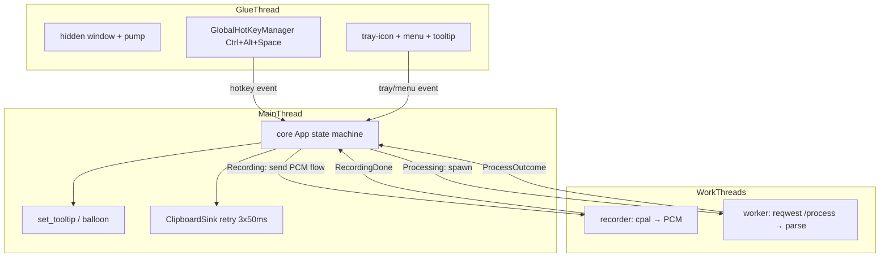

# client Design

**Spec**: `.specs/features/client/spec.md`
**Status**: Draft

---

## Architecture Overview

Single Rust crate (`x9ai-client`) under `client/`, with a platform-agnostic `core`
library (testable on Linux) and a `cfg(windows)` glue module (tray, hotkey, recorder,
clipboard, balloon). The core defines effect traits (`Processor`, `ClipboardSink`,
`Notifier`, `Sleeper`) so every Linux gate runs deterministically with injected fakes;
the glue supplies the real Windows implementations. A thin binary (`main.rs`) is a stub
on Linux and the full Windows runtime on Windows.

The user-facing flow mirrors `docs/spec.md` §4 exactly:

```
[Win32 glue thread]                [Main thread: core App]               [work threads]
 hidden window + pump   ─┐
 tray-icon (tooltip)     ─┼─ mpsc ─▶ App::handle_event ─▶ state machine
 hotkey Ctrl+Alt+Space   ─┘                 │                   │
                                            ├─▶ recorder (cpal)  ┘ Recording
                                            └─▶ worker (HTTP + parse + clipboard + balloon)
```

Threading rules (AD-010-safe, cross-platform where possible):
- **Glue thread** owns the hidden Win32 window, the message pump (`GetMessage`), the
  tray icon, and the `GlobalHotKeyManager` (both crates require the pump on their owning
  thread). It forwards hotkey/tray/menu events over an `mpsc` channel to the app.
- **Main thread** runs the core `App` state machine and effects; never blocks on the
  network.
- **Recorder thread** runs the cpal stream; tracks the 300s cap itself and emits
  `RecordingDone` through the same channel (the cap does not need the app to wake).
- **Worker thread** runs the blocking HTTP request + response parse (`spawn_processing`),
  then returns the outcome to the main loop. Clipboard write and balloon happen on the
  main thread when the outcome arrives.



---

## Approach decision (presented for confirmation)

Three candidate layouts for the client codebase — **A is recommended and used below**:

| Approach | Shape | Trade-off |
| -------- | ----- | --------- |
| **A. Single crate, cfg-gated glue** (recommended) | one `Cargo.toml`, `core` + `glue` modules, Windows deps in `[target.'cfg(windows)'.dependencies]` | Simplest layout; Linux cargo only compiles deps for the host target; Windows cross-check still type-checks the whole crate |
| B. Cargo workspace: `x9ai-core` + `x9ai-bin` | two manifests | Cleaner dep isolation but more surface/boilerplate for a single thin utility |
| C. Windows-only crate | glue in the open | Breaks AD-010 (core untestable on Linux) — rejected |

---

## Code Reuse Analysis

### Existing Components to Leverage

| Component | Location | How to Use |
| --------- | -------- | ---------- |
| `server/x9ai/app.py` HTTP contract (field names, metadata, error mapping) | `server/x9ai/app.py` | The multipart builder + parser implement §6 exactly as the server reads it |
| `server/x9ai/schemas.py` response JSON | `server/x9ai/schemas.py` | `parse_response` mirrors `SuccessResponse`/`ErrorResponse` shapes |
| Serde/reqwest ecosystem (nothing project-local yet in Rust) | — | Standard choice, no existing Rust code exists in the repo (client is the first) |

### Integration Points

| System | Integration Method |
| ------ | ------------------ |
| X9AI server | HTTP `POST http://127.0.0.1:8000/process` (multipart: `audio_file` WAV bytes + `metadata` JSON string), JSON response — §6, confirmed against `app.py:_handle` |
| Windows tray / shell | `tray-icon` (tooltip states + menu) and `Shell_NotifyIcon` `NIF_INFO` balloon on our hidden window |
| Windows global input | `global-hotkey` registered `Ctrl+Alt+Space` |
| Audio input | `cpal` WASAPI default input device |
| Clipboard | `arboard` `Clipboard::set_text`, wrapped by the core retry policy |

---

## Components

### Core library (`src/core/`, all platform-agnostic)

**`src/core/state.rs` — State machine**

- **Purpose**: the `Idle → Recording → Processing → Idle` machine with guarded transitions (§4).
- **Interfaces**:
  - `enum State { Idle, Recording, Processing }`
  - `enum Trigger { Hotkey, RecordingDone(Result<Vec<u8>, RecError>), ProcessOutcome(ProcessOutcome) }`
  - `fn transition(&mut self, t: Trigger) -> Effect` — applies the guard table; returns the effect to execute.
- **Dependencies**: none (pure).
- **Guards** (CLI-01/02/03/04): `Idle+Hotkey→Recording`; `Recording+Hotkey→Processing`; `Processing+Hotkey→*ignored*`; at most one `Recording` active.
- **Reuses**: none.

**`src/core/audio.rs` — WAV writer + metadata**

- **Purpose**: build the §6.1 `.wav` byte stream and the `metadata` JSON.
- **Interfaces**:
  - `fn pcm_to_wav16(mono: &[f32], sample_rate: u32) -> Vec<u8>` — RIFF/WAVE/fmt(16-bit PCM mono)/data; clips f32→i16.
  - `fn metadata_json(timestamp: u64) -> String` — `{"language":"pt","client_timestamp":<ts>}`.
  - `const MAX_RECORD_SECONDS: u32 = 300`.
- **Dependencies**: none (pure, byte-assertable).
- **Reuses**: none.

**`src/core/http.rs` — /process contract**

- **Purpose**: build + send the multipart request, parse the JSON response (§6).
- **Interfaces**:
  - `trait Processor { fn process(&self, wav: Vec<u8>, metadata: &str) -> Result<String, ProcError>; }` — returns normalized text or a generic-diagnostic error.
  - `struct ReqwestProcessor { endpoint: String, timeout: Duration }` — `reqwest::blocking`, `multipart::Form` with `Part::bytes` (`audio_file`) + `.text` (`metadata`); maps non-2xx, `status:"error"`, malformed JSON, io/connect/timeout → `ProcError`.
  - `fn endpoint_from_env(env: Option<&str>) -> String` — `X9AI_SERVER_URL` override, default `http://127.0.0.1:8000`.
  - `const REQUEST_TIMEOUT: Duration = Duration::from_secs(60)`.
- **Dependencies**: `reqwest` (blocking, `default-features=false`, `multipart`, `json`), `serde`/`serde_json`.
- **Reuses**: server field names/JSON from `app.py`/`schemas.py`.

**`src/core/retry.rs` — clipboard write with retry**

- **Purpose**: §4.3 contract — up to 3 attempts, 50ms apart.
- **Interfaces**:
  - `trait ClipboardSink { fn set(&mut self, text: &str) -> Result<(), ClipError>; }`
  - `trait Sleeper { fn sleep(&self, ms: u64); }`
  - `fn write_with_retry(sink: &mut dyn ClipboardSink, text: &str, sleeper: &dyn Sleeper, attempts: usize, delay_ms: u64) -> Result<(), ClipError>` — `attempts=3, delay_ms=50` defaults as consts.
- **Dependencies**: none (logic only; injected sleeper keeps the 50ms deterministic in gates).
- **Reuses**: none.

**`src/core/notify.rs` — final notification mapping**

- **Purpose**: §4.1/4.2 final Success/Error notice.
- **Interfaces**:
  - `enum Notice { Success, Error }`
  - `fn notice_text(n: Notice) -> &'static str` — `"Pronto para colar!"` / `"Falha no processamento. Verifique a conexão com o servidor."`.
  - `trait Notifier { fn show(&self, title: &str, body: &str); }`
- **Dependencies**: none (pure string mapping testable on Linux).
- **Reuses**: none.

**`src/core/app.rs` — orchestration + UI state**

- **Purpose**: bind state transitions to effects; render the §4.2 tooltip labels.
- **Interfaces**:
  - `fn ui_tooltip(state: &State) -> &'static str` — `Recording…` / `Processing…` (matches CLI-06/07), `X9AI` for Idle.
  - `struct App { state: State, ... }` with `on_hotkey()`, `on_recording_ready(Result<Vec<u8>,...>)`, `on_process_outcome(ProcessOutcome)` — each returns an `Effect` enum (`BeginRecording`, `StopAndProcess{wav, meta}`, `Ignore`, `WriteClipboard{text}`, `Notify(Notice)`, `RenderTooltip`, `Quit`).
- **Dependencies**: `state`, `audio`, `notify`.
- **Reuses**: none (new logic, mirrors §4 flow 1-5).

**`src/core/runner.rs` — non-blocking dispatch**

- **Purpose**: CLI-05 — run the HTTP request off the state machine.
- **Interfaces**: `fn spawn_processing<F>(f: F) where F: FnOnce() + Send + 'static` — wraps `std::thread::spawn`; returns immediately.
- **Dependencies**: std only (cross-platform, so the blocking-dispatcher test runs on Linux).
- **Reuses**: none.

### Windows glue (`src/glue/`, `#[cfg(target_os = "windows")]` only)

**`src/glue/mod.rs`**

- **Purpose**: re-export the glue runtime behind `cfg(windows)`; empty on other targets.
- **Interfaces**: `pub fn run() -> Result<(), String>` — the Windows main.

**`src/glue/win_loop.rs` — hidden window + message pump**

- **Purpose**: host the Win32 pump the tray icon + hotkey manager require, and anchor the balloon.
- **Interfaces**: `fn run_msg_loop(tx: Sender<UiEvent>)` — registers class `X9AITrayWindow`, creates a message-only window (`HWND_MESSAGE`), runs `GetMessage`/`DispatchMessage`, posts `WorkerExited` to the app channel on `WM_DESTROY`.
- **Dependencies**: `windows-sys` (`Win32::UI::WindowsAndMessaging`, `Win32::Foundation`).
- **Reuses**: none.

**`src/glue/tray.rs` — tray icon + menu + tooltip + balloon**

- **Purpose**: the sole UI surface (§3.1 tray utility): icon, menu ("Sair"; "Parar gravação" only while Recording), tooltip states, final balloon.
- **Interfaces**:
  - `fn attach_tray(events: Sender<UiEvent>) -> Result<TrayHandle, String>` — `TrayIconBuilder::with_icon(Icon::from_rgba(...))`, `with_menu`, `with_tooltip("X9AI")`; menu ids map to `UiEvent`.
  - `struct TrayHandle { icon: Arc<TrayIcon>, ... }` — `set_state(state: &State)` → `icon.set_tooltip(UiState)` (CLI-06/07).
  - `fn show_balloon(hwnd, title, body)` — `Shell_NotifyIcon(NIM_ADD … NIF_INFO … NIM_DELETE)` on our window (CLI-17/18).
- **Dependencies**: `tray-icon`, `windows-sys` (`Win32::UI::Shell`).
- **Reuses**: `core::app::ui_tooltip`, `core::notify::notice_text`.

**`src/glue/hotkey.rs` — global hotkey**

- **Purpose**: register `Ctrl+Alt+Space` and forward presses.
- **Interfaces**: `fn attach_hotkey(tx: Sender<UiEvent>) -> Result<GlobalHotKeyManager, String>` — `HotKey::new(Some(Modifiers::CONTROL | Modifiers::ALT), Code::Space)`.
- **Dependencies**: `global-hotkey`.
- **Reuses**: none.

**`src/glue/recorder.rs` — cpal capture**

- **Purpose**: record, enforce the 300s cap, hand PCM to the core writer.
- **Interfaces**: `fn record_and_emit(done: Sender<UiEvent>, max_seconds: u32)` — opens the default input device requesting 16 kHz mono; on rejection falls back to `default_input_config()`; converts samples to f32; after stop or the cap, `pcm_to_wav16` + `RecordingDone`.
- **Dependencies**: `cpal`.
- **Reuses**: `core::audio::pcm_to_wav16`.

**`src/glue/clipboard.rs` — arboard sink**

- **Purpose**: the real `ClipboardSink`.
- **Interfaces**: `impl ClipboardSink for ArboardClipboard` via `arboard::Clipboard::new().set_text(...)`.
- **Dependencies**: `arboard`.

**`src/glue/app_loop.rs` — wiring**

- **Purpose**: connect everything on the main thread: select over the incoming `UiEvent` channel, drive `App`, spawn recorder/worker threads, apply effects (tooltip, clipboard+retry, balloon).
- **Dependencies**: all glue + core.

**`src/main.rs` — binary**

- **Purpose**: `#[cfg(target_os="windows")]` → `glue::run()`; otherwise a stub explaining the client is Windows-only (keeps Linux `cargo build`/`test` green, per AD-010).

---

## Data Models

```rust
pub enum State { Idle, Recording, Processing }

pub enum ProcessOutcome { Success { text: String }, Error }   // §6.2

pub enum Notice { Success, Error }                            // §4.1/4.2

pub enum Effect {                                             // app → runner directives
  BeginRecording,
  StopAndProcess { wav: Vec<u8>, metadata: String },
  Ignore,
  WriteClipboard { text: String },                            // writes via write_with_retry
  Notify(Notice),                                             // balloon + tooltip reset
  RenderTooltip(&'static str),
  Quit,
}

pub struct Recording { wav: Vec<u8>, timestamp: u64 }         // built by recorder, sent as audio_file + metadata.client_timestamp
```

Relationships: `State` is owned by `App`; `Effect` is what glue executes; `ProcessOutcome` is returned by the worker and re-fed as `Trigger::ProcessOutcome`.

---

## Error Handling Strategy

| Error scenario | Handling | User impact |
| -------------- | -------- | ----------- |
| Server unreachable / non-2xx / `status:"error"` / malformed JSON / timeout | `ReqwestProcessor` → `ProcError` → `ProcessOutcome::Error` | Balloon "Falha no processamento…"; no clipboard write (CLI-14) |
| Zero-byte recording | recorder check → `RecordingDone(Err)` → `ProcessOutcome::Error` path | Same generic balloon; no HTTP request (CLI-09) |
| Clipboard lock | `write_with_retry` 3×50ms; final failure → `Notice::Error` (CLI-16) | Generic error balloon |
| No default input device | recorder start fails → generic error ballon, back to `Idle` | Generic error balloon; no HTTP (Edge Cases) |
| Tray/hotkey registration failure | main exits after error balloon attempt | Exit with the generic message logged |
| Recording ≥ 300s | recorder auto-stops | Processed like a manual hotkey stop (CLI-10) |

---

## Risks & Concerns

| Concern | Location | Impact | Mitigation |
| ------- | -------- | ------ | ---------- |
| Win11 may suppress legacy `NIF_INFO` balloons for apps without an AUMID | `glue/tray.rs` (new) | CLI-17/18 balloon silently not visible | Documented in the Windows manual UAT step (AD-010). If suppressed, follow-up: register an AUMID via a Start-menu `.lnk` and switch to WinRT toasts — deferred, not built now |
| cpal 16 kHz mono request may be rejected on some WASAPI devices | `glue/recorder.rs` (new) | Recording fails at start | Fall back to `default_input_config()` and write the WAV at the true rate (reported in header); faster-whisper resamples at decode (`transcriber.py`) |
| Windows deps must type-check under `cargo check --target x86_64-pc-windows-gnu` from Linux | `client/Cargo.toml` | Glue compile errors invisible until the Windows build | Gate: cross-target `cargo check` on Linux; if a dep blocks it, fall back to a documented Windows build + the type-check is done there |
| tray-icon + global-hotkey require a Win32 pump on their owning thread | `glue/win_loop.rs` (new) | Events never delivered | Dedicated glue thread with hidden window + `GetMessage` pump; tray/hotkey created on that thread |
| Balloon via second `Shell_NotifyIcon` NIM_ADD then NIM_DELETE | `glue/tray.rs` (new) | Transient duplicate tray icon while ballooning | Accept (notification lasts seconds); message-only anchor window; documented in UAT |
| `reqwest` default-features=false drops system proxy/TLS | `core/http.rs` | Only relevant to localhost — intended (context decision) | Documented in `context.md`; no action |
| None in existing repo | — | — | Client is the first Rust code; no legacy to break |

---

## Tech Decisions

| Decision | Choice | Rationale |
| -------- | ------ | --------- |
| Layout | Single crate, cfg-gated glue (Approach A) | Simplest correct shape for a thin utility; Linux cargo ignores Windows-only deps |
| HTTP | `reqwest` blocking, `default-features=false` + `multipart` + `json` | localhost-only, no TLS; built-in multipart correction; blocking on a worker thread keeps the loop async UX |
| Notification | Classic tray balloon (`Shell_NotifyIcon` NIF_INFO), per user decision | No AUMID/Start-menu registration needed for a portable exe; risk logged |
| Hotkey | Fixed `Ctrl+Alt+Space` | Spec assumption; no rebind UI in v1 |
| Recording | 16 kHz mono PCM16 WAV preferred; device-default fallback; 300s cap | Whisper resamples; cap stays under 50 MB server limit |
| Clipboard | arboard + core retry (3×50ms, injected sleeper) | §4.3 exact contract, deterministic gates |
| Cross-compile gate | `cargo check --target x86_64-pc-windows-gnu` from Linux when the deps allow | Proves the glue compiles before the Windows UAT |

> **Project-level decisions**: AD-013 — Windows client glue stack locked (tray-icon, global-hotkey, cpal, arboard, classic `Shell_NotifyIcon` balloon; Linux-gating via `cargo check --target x86_64-pc-windows-gnu`). AD-014 — client endpoint default `http://127.0.0.1:8000` overridable via `X9AI_SERVER_URL`. Both appended to `.specs/STATE.md` in the tasks phase when the design is approved.

---

## Design Confirmation Checklist

- [x] User decisions honored: crate stack (minus winrt-notification → balloon, re-confirmed), tray tooltip states + final balloon, env-override endpoint, autostart deferred
- [x] AD-001..AD-012 conformed (Rust client AD-001, single boundary AD-003, Linux-testable core AD-010, one branch per feature AD-012)
- [x] Spec ACs CLI-01..18 map to components: state→01..04, runner→05, tray/tooltip→06/07, audio→08..10, http→11..14, retry→15/16, notify→17/18
- [x] Implicit-requirement sweep covered in the spec (bounds, failure, retry, concurrency, lifecycle, observability, transition integrity)